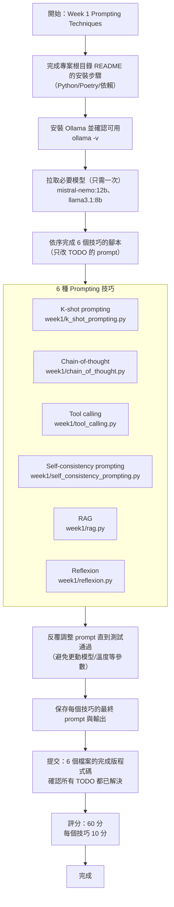

# Week 1 — Prompting Techniques

> 中文導讀：
> - 本週會練習 6 種常見的 prompting 技巧。每個技巧都對應一個 Python 腳本。
> - 你要做的主要工作是：在每個檔案中把 `TODO` 的 prompt 補齊，並反覆調整直到測試通過。
> - 除了 `TODO` 的區塊以外，建議不要改動模型、溫度等參數，方便評分與對照。

You will practice multiple prompting techniques by crafting prompts to complete specific tasks. Each task’s instructions are at the top of its corresponding source file.

## Installation
Make sure you have first done the installation described in the top-level `README.md`. 

> 中文：先依照專案根目錄的 README 把 Python/Poetry/依賴裝好。

## Ollama installation
We will be using a tool to run different state-of-the-art LLMs locally on your machine called [Ollama](https://ollama.com/). Use one of the following methods:

> 中文：本週用 Ollama 在本機跑模型（不用雲端 API）。先把 Ollama 安裝好，並確保服務可用。

- macOS (Homebrew):
  ```bash
  brew install --cask ollama 
  ollama serve
  ```

- Linux (recommended):
  ```bash
  curl -fsSL https://ollama.com/install.sh | sh
  ```

- Windows:
  Download and run the installer from [ollama.com/download](https://ollama.com/download).

Verify installation:
```bash
ollama -v
```

> 中文：確認 `ollama -v` 能輸出版本號，表示安裝成功。

Before running the test scripts, make sure you have the following models pulled. You only need to do this once (unless you remove the models later):
```bash
ollama run mistral-nemo:12b
ollama run llama3.1:8b
```

> 中文：第一次會把模型下載到本機，會花一點時間與磁碟空間；之後就不用重拉。

## Techniques and source files
- K-shot prompting — `week1/k_shot_prompting.py`
- Chain-of-thought — `week1/chain_of_thought.py`
- Tool calling — `week1/tool_calling.py`
- Self-consistency prompting — `week1/self_consistency_prompting.py`
- RAG (Retrieval-Augmented Generation) — `week1/rag.py`
- Reflexion — `week1/reflexion.py`

### 每個程式要執行的任務（中文說明）
- K-shot prompting：透過系統提示詞讓模型只輸出反轉後的字串，且必須完全符合指定答案。
- Chain-of-thought：讓模型先推理再作答，最後一行固定輸出格式 Answer: <number>，並正確解出模運算題。
- Tool calling：讓模型輸出「單一 JSON 物件」來描述工具呼叫（tool + args），程式解析並執行工具後比對結果。
- Self-consistency prompting：以較高溫度多次生成答案，抽取最後一行 Answer: <number> 後用多數決得到正確解。
- RAG：只能使用提供的 Context 回答，輸出單一 Python 程式碼區塊，且包含指定必要片段（API 呼叫、標頭等）。
- Reflexion：先產生函式、跑測試、收集失敗訊息，再把失敗資訊回饋給模型生成改進版本。

> 中文：每個檔案最上方都有任務描述。你會看到 `YOUR_SYSTEM_PROMPT = ""` 或類似 TODO，將它補成你設計的 prompt。

## Deliverables
- Read the task description in each file.
- Design and run prompts (look for all the places labeled `TODO` in the code). That should be the only thing you have to change (i.e. don't tinker with the model). 
- Iterate to improve results until the test script passes.
- Save your final prompt(s) and output for each technique.
- Make sure to include in your submission the completed code for each prompting technique file. ***Double check that all `TODO`s have been resolved.***

> 中文提醒：提交前用搜尋功能找 `TODO`，確認 week1 的每個檔案都已填完。

## Evaluation rubric (60 pts total)
- 10 for each completed prompt across the 6 different prompting techniques

---

<<<<<<< HEAD
## 中文註解（詳細版）
本週主題：練習 6 種提示工程技巧。每個技巧都有對應的 Python 檔案，**你只需補齊 TODO 的 prompt**，不要改模型或參數，便於評分。

### 安裝與環境
- 先依照專案根目錄的 README 安裝 Python、Poetry 與依賴。
- 本週使用 Ollama 在本機跑模型。

### Ollama 安裝與模型
- macOS：`brew install --cask ollama`，再執行 `ollama serve`。
- Linux：依官方腳本安裝。
- Windows：到 ollama.com 下載安裝。
- 透過 `ollama -v` 確認版本。
- 先拉取模型（只需一次）：
  - `ollama run mistral-nemo:12b`
  - `ollama run llama3.1:8b`

### 本週檔案與技巧
- K-shot prompting：`week1/k_shot_prompting.py`
- Chain-of-thought：`week1/chain_of_thought.py`
- Tool calling：`week1/tool_calling.py`
- Self-consistency prompting：`week1/self_consistency_prompting.py`
- RAG：`week1/rag.py`
- Reflexion：`week1/reflexion.py`

### 交付內容
- 逐一閱讀每個檔案上方的任務說明。
- 填好所有 TODO 的 prompt，並反覆測試到通過。
- 保留你最後的 prompt 與輸出結果。
- 提交前確認所有 TODO 都已完成。

### 評分
- 6 個技巧各 10 分，合計 60 分。
=======
## 作業流程（Mermaid）


>>>>>>> 96a9c83a959e1c030db4429856095dba89481345
