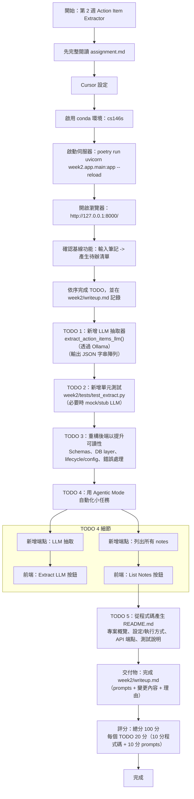

# Week 2 – Action Item Extractor

> 中文註解：
> 本週作業要在既有的 FastAPI + SQLite 小專案上加功能：把「自由輸入的筆記」轉成「可勾選的待辦事項（action items）」清單。

This week, we will be expanding upon a minimal FastAPI + SQLite app that converts free‑form notes into enumerated action items.

## 中文註解（本週重點）
- 目標：擴充既有 FastAPI + SQLite 筆記→行動項目（action items）應用。
- 你要做的事：在後端加入 LLM 抽取、補測試、重構、加端點與前端按鈕、並產出 README。
- 交付：完成程式修改並在 writeup.md 記錄你用的提示與變更。

***We recommend reading this entire document before getting started.***

> 中文註解：
> 建議先把整份作業說明讀完再動手，避免做到一半才發現漏了要求或要重構。

Tip: To preview this markdown file
- On Mac, press `Command (⌘) + Shift + V`
- On Windows/Linux, press `Ctrl + Shift + V`

> 中文註解：
> 這是 VS Code/Cursor 的 Markdown 預覽快捷鍵；用預覽模式閱讀會比較舒服。


## Getting Started

> 中文註解：
> 這一段是把開發環境與專案跑起來的基本步驟。先確保你能成功啟動伺服器並在瀏覽器操作現有功能。

### Cursor Set Up
Follow these instructions to set up Cursor and open your project:
1. Redeem your free year of Cursor Pro: https://cursor.com/students
2. Download Cursor: https://cursor.com/download
3. To enable the Cursor command line tool, open Cursor and press `Command (⌘) + Shift+ P` for Mac users (or `Ctrl + Shift + P` for non-Mac users) to open the Command Palette. Type: `Shell Command: Install 'cursor' command`. Select it and hit Enter.
4. Open a new terminal window, navigate to your project root, and run: `cursor .`

> 中文註解：
> Cursor 是類 VS Code 的編輯器，這裡是在教你安裝並用命令列從專案根目錄開啟。
> 若你已經在 VS Code 開好了也沒關係，但作業希望你使用 Cursor 的 AI 功能輔助。

### Current Application
Here's how you can start running the current starter application: 
1. Activate your conda environment.
```
conda activate cs146s 
```
2. From the project root, run the server:
```
poetry run uvicorn week2.app.main:app --reload
```
3. Open a web browser and navigate to http://127.0.0.1:8000/.
4. Familiarize yourself with the current state of the application. Make sure you can successfully input notes and produce the extracted action item checklist. 

> 中文註解：
> 「先跑起來」是最重要的檢查點：
> 1) conda 環境要啟用成功；2) `uvicorn` 能跑；3) 網頁能打開；4) 輸入筆記後能看到抽出的待辦清單。
> 之後加功能/重構時，這些就是你回歸測試的基準。

## Exercises
For each exercise, use Cursor to help you implement the specified improvements to the current action item extractor application.

> 中文註解：
> 下面的 TODO 1~5 是本週的五個練習題，每題 20 分。

As you work through the assignment, use `writeup.md` to document your progress. Be sure to include the prompts you use, as well as any changes made by you or Cursor. We will be grading based on the contents of the write-up. Please also include comments throughout your code to document your changes. 

> 中文註解：
> 評分很看重你的 `writeup.md`：
> - 你下了哪些提示詞（prompts）
> - Cursor/你自己做了哪些修改
> - 程式碼裡也要有必要的註解（不是每行都註解，而是說明你改動的理由/行為）。

### TODO 1: Scaffold a New Feature

Analyze the existing `extract_action_items()` function in `week2/app/services/extract.py`, which currently extracts action items using predefined heuristics.

Your task is to implement an **LLM-powered** alternative, `extract_action_items_llm()`, that utilizes Ollama to perform action item extraction via a large language model.

> 中文註解：
> 目標：新增一個用 LLM 抽取 action items 的版本（不是改掉舊版），函式名指定為 `extract_action_items_llm()`。
> 「Scaffold」的意思是先把功能骨架搭好：包含呼叫 Ollama、組 prompt、拿到結構化輸出、以及錯誤處理/回傳格式。

Some  tips:
- To produce structured outputs (i.e. JSON array of strings), refer to this documentation: https://ollama.com/blog/structured-outputs 
- To browse available Ollama models, refer to this documentation: https://ollama.com/library. Note that larger models will be more resource-intensive, so start small. To pull and run a model: `ollama run {MODEL_NAME}`

> 中文註解：
> 建議你要求模型輸出「JSON 字串陣列」(例如 `["Buy milk", "Email Bob"]`) ，這樣後端解析/測試更穩。
> 模型先用小的（省 RAM/速度快）驗證流程，再視需要換大模型。

### TODO 2: Add Unit Tests 

Write unit tests for `extract_action_items_llm()` covering multiple inputs (e.g., bullet lists, keyword-prefixed lines, empty input) in `week2/tests/test_extract.py`.

> 中文註解：
> 你要替 LLM 版抽取函式補測試，至少涵蓋：
> - 子彈列點/條列輸入
> - 以關鍵字開頭的行（例如 "TODO:"、"Action:"）
> - 空字串或只有空白
> 實務上會需要「可重現」的測試策略：例如 mock 掉 Ollama 回應，或把模型呼叫包一層以便替換。

### TODO 3: Refactor Existing Code for Clarity

Perform a refactor of the code in the backend, focusing in particular on well-defined API contracts/schemas, database layer cleanup, app lifecycle/configuration, error handling. 

> 中文註解：
> 這題不是加功能，而是提升可讀性與可維護性：
> - API 的 request/response schema 要清楚（Pydantic 模型/回傳格式一致）
> - DB 存取分層（把雜亂的 SQL/連線邏輯整理乾淨）
> - app 啟動/關閉流程、設定管理更明確
> - 錯誤處理要一致（例如輸入不合法、模型失敗、DB 失敗時回什麼 HTTP 狀態碼）

### TODO 4: Use Agentic Mode to Automate Small Tasks

1. Integrate the LLM-powered extraction as a new endpoint. Update the frontend to include an "Extract LLM" button that, when clicked, triggers the extraction process via the new endpoint.

2. Expose one final endpoint to retrieve all notes. Update the frontend to include a "List Notes" button that, when clicked, fetches and displays them.

> 中文註解：
> 這題偏「端到端」整合：
> - 後端新增路由：一個是 LLM 抽取的 API，一個是列出所有 notes 的 API
> - 前端加兩個按鈕並串接 API，能在畫面上看到結果
> 這裡提到 Agentic Mode：意思是善用 Cursor 的代理/自動化能力來完成小任務，但最後你仍要檢查與修正產出。

### TODO 5: Generate a README from the Codebase

***Learning Goal:***
*Students learn how AI can introspect a codebase and produce documentation automatically, showcasing Cursor’s ability to parse code context and translate it into human‑readable form.*

Use Cursor to analyze the current codebase and generate a well-structured `README.md` file. The README should include, at a minimum:
- A brief overview of the project
- How to set up and run the project
- API endpoints and functionality
- Instructions for running the test suite

> 中文註解：
> 這題是要你示範「AI 讀程式碼後自動寫文件」：README 至少要讓新同學能跑起來、知道有哪些 API、也知道怎麼跑測試。

## Deliverables
Fill out `week2/writeup.md` according to the instructions provided. Make sure all your changes are documented in your codebase. 

> 中文註解：
> 交付物重點是 `week2/writeup.md`（含 prompts + 你做了什麼），以及專案裡實際的程式碼變更。

## Evaluation rubric (100 pts total)
- 20 points per part 1-5 (10 for the generated code and 10 for each prompt).

<<<<<<< HEAD
---

## 中文註解（詳細版）
### 本週目標
以現有 FastAPI + SQLite 應用為基礎，擴充「從自由文字筆記萃取行動項目」的功能，並練習 LLM + 測試 + 重構 + 前後端整合。

### 起始設定與啟動
1. 啟用 conda 環境：`conda activate cs146s`
2. 啟動伺服器：`poetry run uvicorn week2.app.main:app --reload`
3. 瀏覽器開啟 `http://127.0.0.1:8000/`
4. 先熟悉目前功能（輸入筆記 → 產生 checklist）

### TODO 任務說明
1) **加入 LLM 抽取**：
	- 研讀 `extract_action_items()`（啟發式抽取）。
	- 新增 `extract_action_items_llm()` 使用 Ollama 模型輸出結構化 JSON（字串陣列）。

2) **新增測試**：
	- 在 `week2/tests/test_extract.py` 補 LLM 抽取的單元測試（多種輸入型態）。

3) **重構後端**：
	- 改善 API schema/contract、資料庫層、生命週期設定、錯誤處理等。

4) **Agentic 自動化小任務**：
	- 新增 LLM 抽取端點與前端按鈕「Extract LLM」。
	- 新增「列出所有 notes」端點與前端按鈕「List Notes」。

5) **產生 README**：
	- 讓 AI 讀程式碼自動生成 README：專案概述、安裝/執行、API 端點、測試指令。

### 交付與評分
- `week2/writeup.md` 需記錄你的提示與變更。
- 每個 TODO 20 分（10 分程式 + 10 分 prompt）。
=======
> 中文註解：
> 每題 20 分：其中 10 分看「程式碼/成果」，另 10 分看「提示詞與使用 AI 的過程記錄」。

---

## 作業流程（Mermaid）


>>>>>>> 96a9c83a959e1c030db4429856095dba89481345
